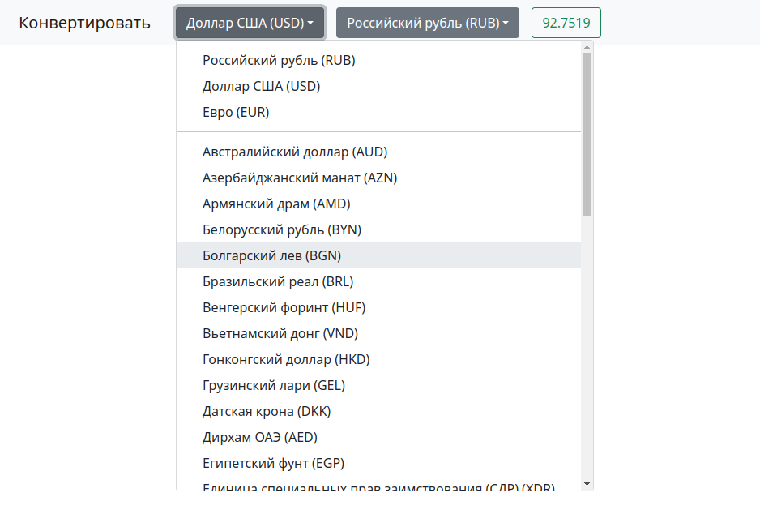
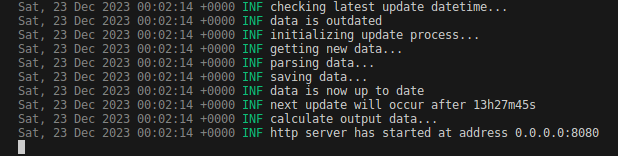
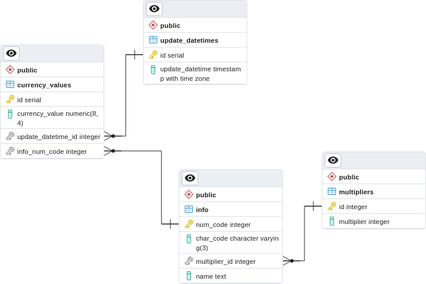

# Currency Converter

**Currency Converter**&nbsp;&mdash; это веб-приложение, позволяющее получать данные об иностранных валютах, сохранять их базу (для возможного построения статистики), и конвертировать из одной в другую, используя удобный веб-интерфейс. Данные о валютах берутся из государственных источников страны РФ. Курсы валют обновляются раз в сутки, так что можно настроить желаемое время их получения.



*Вид приложения в браузере*

# Техническая сторона

Сервер отвечает за парсинг данных курсов валют с сайта-источника. За актуальностью данных следит внутренний планировщик, который запускает обновление из источника каждый день в указанное время (по умолчанию 13:30) или, если время спустя последнее обновление превышает 24 часа. Полученные парсингом данные форматируются из одного формата в другой, более подходящий для сбора их клиентской частью.

Клиентский код приложения не производит сортировку данных (они приходят к нему уже отсортированными). Он также следит за обновлениями и проверяет, доступен ли сервер для получения данных. По умолчанию запрос к серверу повторяется каждые 5 минут. Выбрав обе валюты на странице веб-приложения результат отношения 1 единицы валюты справа к 1 единице валюты слева автоматически будет выведен в зеленой рамке веб-интерфейса приложения.



*Логи в консоли серверного приложения*



*Схема таблиц в базе данных*

# Требования

### Установленное ПО:

- Docker
- Утилита make
- Утилита migrate

# Применение

Прежде чем производить миграцию схемы базы данных и запуск развертывания приложения необходимо создать файл `.env`, хранящий переменные окружения, используемые данным приложением. Это можно сделать командой копирования файла шаблона `template.env` с последующим переименованием:

```
cp ./template.env ./.env
```

После того, как вы создали файл `.env`, откройте его в любом текстовом редакторе и добавьте к переменной `DB_PASSWORD` значение пароля, предназначенного для взаимодействия серверной части приложения с базой данных. После чего сохраните файл. Пример:

```
DB_PASSWORD=YourDatabasePassword
```

Далее необходимо произвести автоматическую **миграцию** схемы базы данных (в корневом каталоге будет создана директория `.dbdata`, в которую будут скопированы файлы базы данных из контейнера с СУБД). Выполните следующую команду:

```
make migrate
```

Для **сборки** приложения в **Docker** выполните эту команду:

#### Для Linux:

```
docker compose build
```

#### Для MacOS:

```
docker-compose build
```

Для **запуска** приложения в контейнерах **Docker** выполните следующую команду (она также запустит сборку, если таковой не было произведено):

#### Для Linux:

```
docker compose up
```

#### Для MacOS:

```
docker-compose up
```

Чтобы воспользоваться **веб-интерфейсом** приложения откройте интернет-браузер и перейдите в нем по адресу:

```
http://localhost:8090/
```

Для того, чтобы **остановить** запущенные **Docker**-контейнеры и конфигурации текущего развертывания, выполните команду:

#### Для Linux:

```
docker compose down
```

#### Для MacOS:

```
docker-compose down
```

Для **сборки серверного компонента** приложения на **локальном** компьютере выполните команду:

```
make build
```

Чтобы **запустить серверный компонент** приложения на **локальном** компьютере выполните следующую команду:

```
make run
```

Для **быстрого запуска серверного компонента** в процессе разработки выполните команду:

```
make fast-run
```

Для **сокращения** предыдущей команды можно ввести просто:

```
make
```

Существует возможность **сохранить данные валют**, получаемые из сети, директорию `save` в корневом каталоге проекта. Сохранение в файл производится командой:

```
make save
```

# Траблшутинг

Если при развертывании в Docker постоянно появляется ошибка *"This port already in use"* попробуйте поменять этот порт, о котором говорится в ошибке, с помощью того же файла с параметрами `.env`.

Если при открытии веб-интерфейса приложения в браузере появляется страница с ошибкой *"Could not resolve host: localhost"*, замените в поле адреса слово `localhost` на `127.0.0.1` и перейдите по данному адресу.
