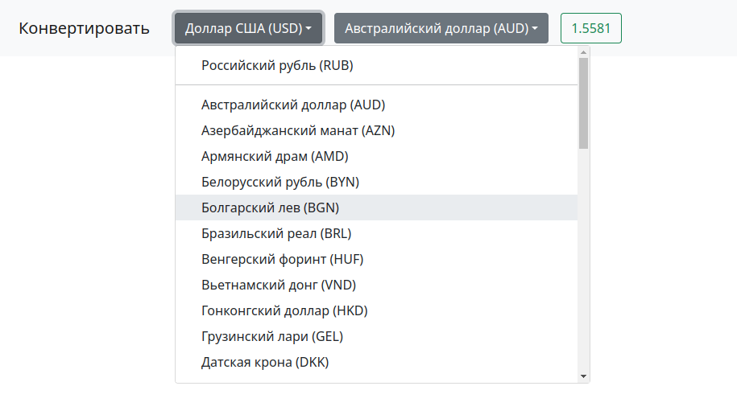
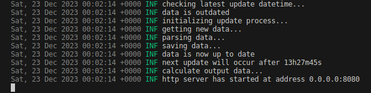
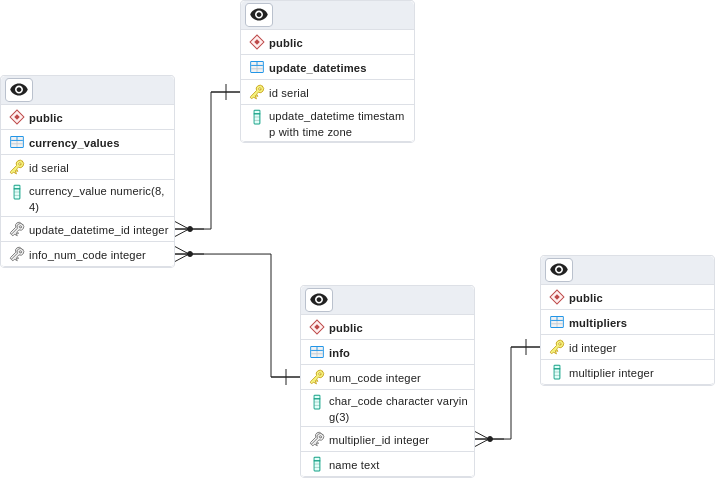

# Currency Converter

This application allows you to receive data on foreign currencies, save their database (for possible construction of statistics) and convert from one to another using a convenient web interface. Data on currencies is taken from government sources of the Russian Federation.


*Web application view in a browser*

# Usage

Use **Docker Compose** to deploy the project:

```
docker compose up
```

# Saving to a File

It is possible to save data received from the network to a file on disk (or specify the file as the data source for updating). Saving to a file is done with the command:

```
cd build
server --save
```

# Tech Side

The currencies are formatted from one format to another, more suitable for the client side. Data updates are monitored by an internal scheduler that triggers updates from sources every day at the specified time (default 13:30) or if the time after the last update exceeds 24 hours. Data from open sources is updated once a day, so you can set the desired time to receive it.

The application client code does not sort the data (it comes to it already sorted). It also monitors for updates and checks if the server is available to receive data. By default, the request to the server is repeated every 5 minutes. By selecting both currencies on the web application page, the result of the ratio of 1 unit of currency on the right to 1 unit of currency on the left will automatically be displayed in a green frame.


*Console logs of backend server*


*Database schema that used in project*
